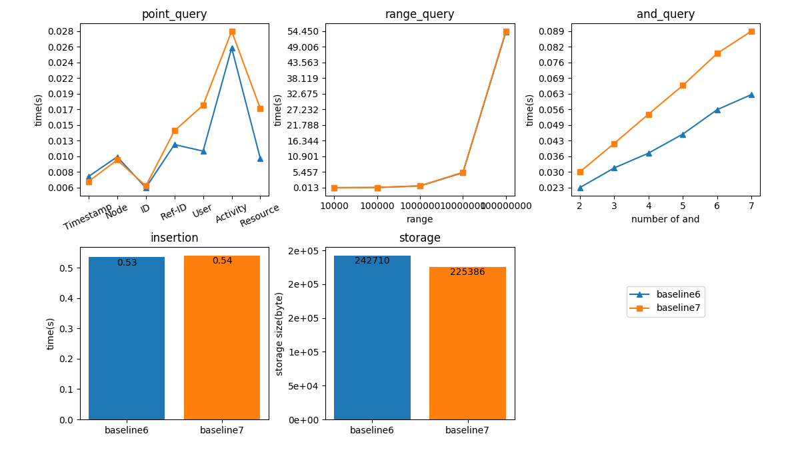
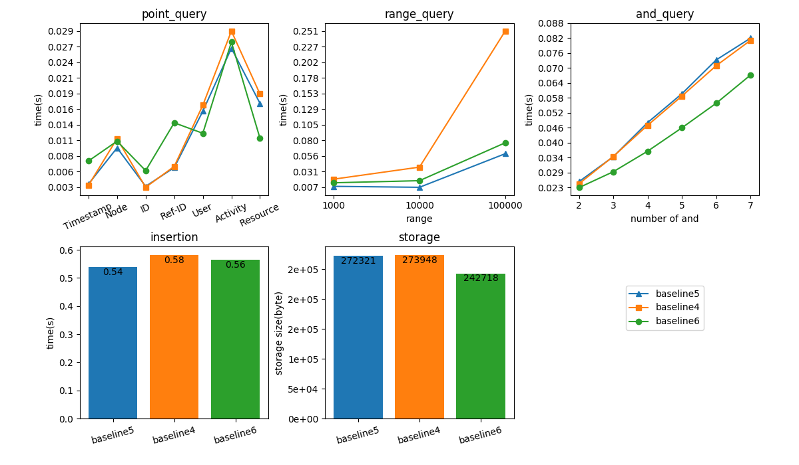
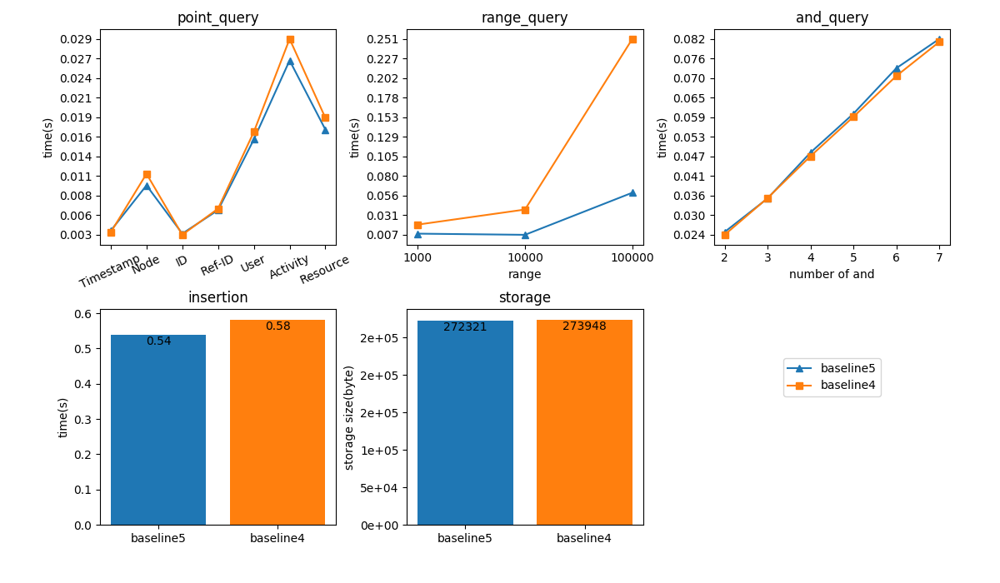
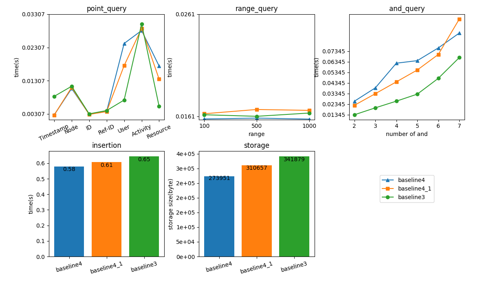
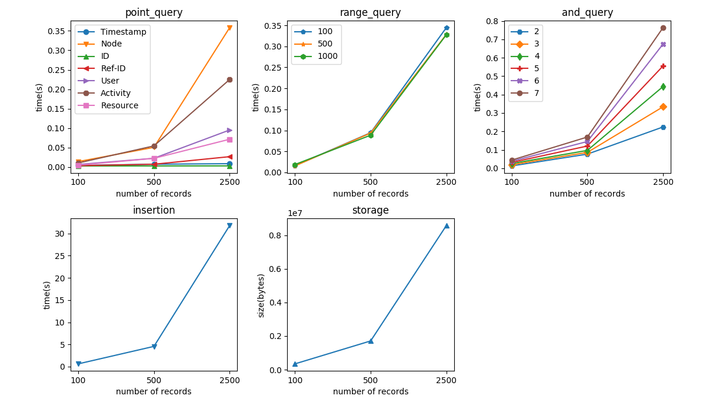
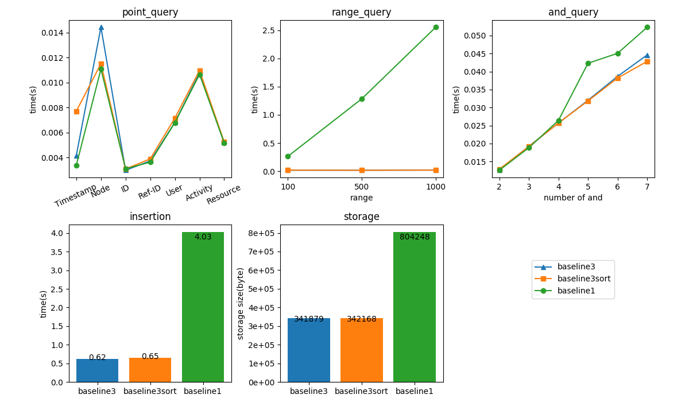
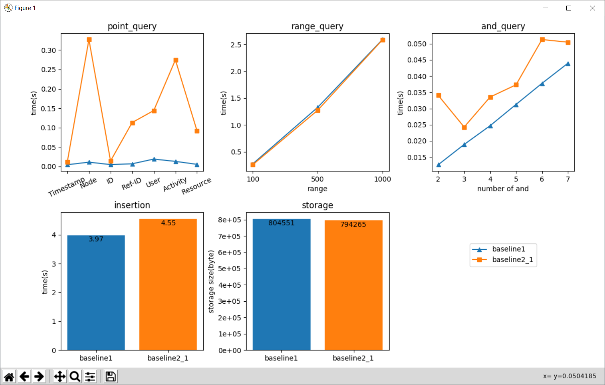

#### 08/21/2018
- Baseline7  
  Baseline6 + [database normalization](#07172018)  
  
#### 08/01/2018
- Baseline6  
  **New feature found**  
  In json-rpc call, we can batch multiple calls into an array and send it to server once.
  Now instead of sending multiple calls which bottleneck the performance (latency
  = # of calls * network latency), we batch multiple calls and sent it only
  once. The server will desterilize calls locally, hence the former bottleneck
  is not a problem anymore.  

  Based on this idea, we reconstruct transaction structure  
  - Before: We write the same data into multiple streams in one transaction.
  Every vout of the transaction contains the same data. The data is duplicated
  many times in that transaction.
  - After: Write the actual date into one stream, and write empty data to the
  other streams in the same transaction. All those stream items will share the
  same _txid_ so we can use _getstreamitem_ to retrieve the item from the first
  stream after finding that _txid_ from listing the other stream items. The result
  often contains multiple _txid_, and we use batch call to query the actual data.
  Note: this approach is similar to unique ID approach. See [06/28/2018](#06282018)  

  Now the usage of storage has improved.  
  

- Baseline5  
  Build multi-level indexing structure for timestamp on blockchain
    - 1-level: timestamp gap = 10000. In this level, one key stores about ten
    values.
    - 2-level: timestamp gap = 1-level gap * 100. In this level, one key stores
    100 1-level key-values records.
    - n-level: timestamp gap = (n-1) level gap * 100. One key stores 100 (n-1)-
    level key-values records.    

  The number of level is determined by the range of timestamp.(NEED TO DO MORE
    TESTES LATER)  
  Now, the range query gets a batch of records at once.  
     

#### 07/17/2018
- Baseline4 (database normalization)  
    Most lines' ref-ID are refer back to the same original ID which means those
    lines' User and Resource are the same. For this reason, we can exclude User
    and Resource in transaction. When querying User and Resource, the baseline4
    first get its original *Node*+*ID*, and then using *Node*+*ID* to query additional
    result and union them.  
    - In memory solution(baseline4): First query *Node*, then extracting the lines that
    has matching *ID*.  
    - On Blockchain solution(baseline4_1): Create an additional *Node*+*Ref-ID* stream whose
    key is *Node*+*Ref-ID* and value is log record. We can query *Node*+*ID* =
    *Node*+*Ref-ID* to get the additional result.  

 Obviously, the former solution use more memory (we don't have the ability to benchmark the memory yet), and latter solution requires more space.   

 

- Multithreading  
Idea: Sending multiple queries at the same time to reduce the effect of network latency.  
Result: It seems that it has very little improvement.  

- Some assumptions and designing principles of log system
  - We assume users keep logging all actives all the time, so the number of
  insertion operation is large.
  - We assume users only check log once in a while, so the number of
  querying operation is small.  
  - The storage should be as small as possible.
  - If the second assumption is correct, when the user is doing the query, the
  fair amount of memory usage should be allowed.
  - The dominating fact of query performance is the network latency

- (Doing) Build an indexing tree for timestamp on blockchain.

#### 07/09/2018
- Scalability test  
Use 100, 500, 2500 records to test the scalability. _Maybe should use equal scale
instead??_
  

- Reimplement baseline3 using Unique-ID approach. See [06/28/2018](#06282018)
development log (baseline2 chart interpretation).   
When the querying result is large (number of record is large), the Unique-ID approach
needs additional N times query (N = number of record). The Unique-ID saves about
20% space, but the average querying time increases 10 times.

- (Doing) Use database normalization techniques to reduce blockchain size

#### 07/05/2018
- (Done) Baseline3  
  - Using multiple streams to insert data to Blockchain:  
one line in log data -> one transaction, and the transaction will add data to
multiple streams(tables) atomically. It reduces the number of transactions to 1/7
(7 is the number of attributes). As a result, the insertion time and storage are
both decreased dramatically. See figure blow.
  - Build an indexing solution for timestamp:  
    - Retrieve all timestamps from Blockchain
    - Build a sorted list for the timestamps  

    Now, we are able to do fast range query, however, **this solution builds an index
  table in memory which is prohibited by the competition**. We just use it as
  an experiment for now.
- (Done) Sorting function  
We are able to sort the result of querying. The test only use **400** records, so
it does not show any significant difference in time. We will increase the number
of records later.

- (Doing) Learning indexing techniques
  - [x] B tree
  - [x] K-d tree
  - [ ] R tree
  - [ ] Hierarchy indexing
- (To-do) Build a solution using modern indexing techniques
  

#### 06/28/2018
* (Done) Baseline2 and Baseline2.1
  * Baseline2:
    * First, we store the record as key = SHA1 hash of record, value = plaintext of record.
    * Then, we store its k attributes info as key = hash of i-th attributes, value = SHA1 hash of the record; hence, the hash of this record (instead of the plaintext) is duplicated k times.
  * Baseline2.1:
    * Using (Node# + ID) as key. Pro: eliminate the risk of hashing collision
* (Done) Benchmark Plotting tool.
* (Doing) Learning indexing techniques
  - [x] B tree
  - [ ] K-d tree
  - [ ] R tree
* (TO-DO) Build a solution using modern indexing techniques

Chart interpretation:  
* Point Query: (using Node attribute as an example)
  * Baseline1: query once, and returns all record
  * Baseline2: the first query gets all pointers, and the second N times query( N =  number of pointers from the first query) get the actual record.    
  Since Node attribute returns the largest number of record, it takes the longest time.
* Range Query: The most query results are _None_, so two baselines have approximately same Performance  
* And Query: Baseline2: The intersection of **2** _And_ is large(number of query is large), so
the second query(pointer-> actual value) takes very long time.
* Insertion time: reason explained above.
* Storage: total size = sum(transactions), transaction size = some constant content( sender address, receiver address, script,...) + actual data. The constant part size is way larger than the actual data size, so it mitigates the effort of hashing(saving storage).

#### 06/20/2018
- (Done) Shell script for automatically creating nodes and blockchain
- (Done) Performance evaluation program Single field query
  - Multiple field query and AND operation
  - Range query
- (Done) Baseline implementation version 0.1
  - Insertion: insert n (n = number of attribute) times copy to blockchain, using attribute
  as key and entire line as value
  - Range query: query from start time, and increase timestamp by 1 every time till end time. The total number of query needed is (start - end)
  - And operation: query using single attribute and do AND operation locally
